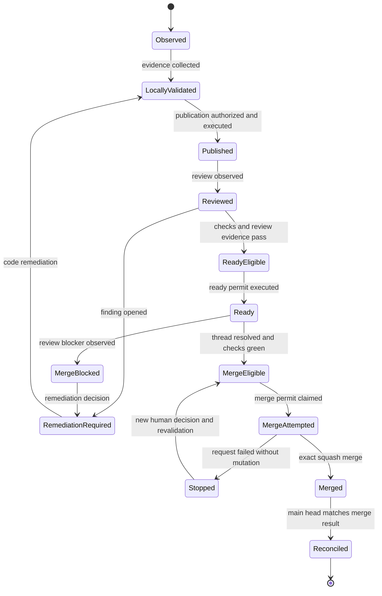

# State Machine

Observed, eligible, authorized, executed, reconciled, and stopped are distinct states. Eligibility did not execute an effect, and an executed failed request did not authorize a fallback.

